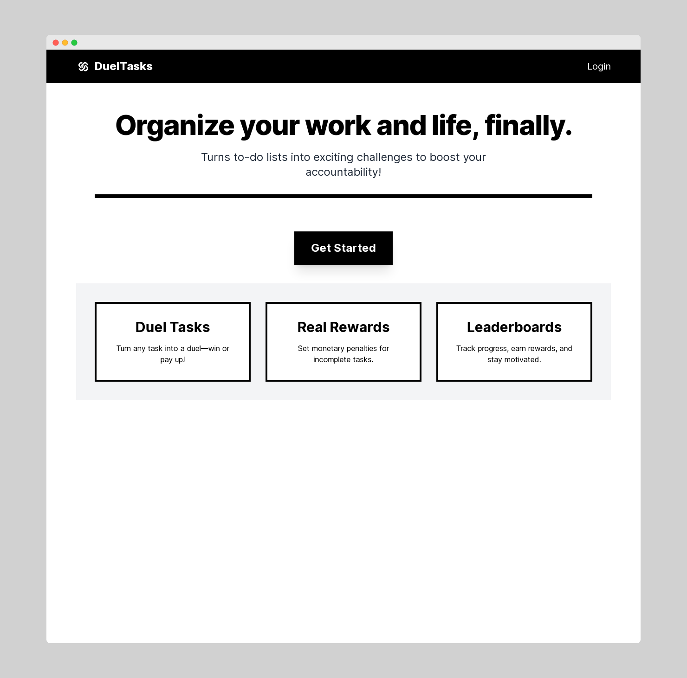

# DuelTasks

DuelTasks is a simple multiplayer productivity tool built with Ruby on Rails.



## Requirements

- Ruby 3.3.4
- Rails 8.x
- PostgreSQL

## Getting Started
```bash
git clone https://github.com/adnjoo/dueltasks
bundle install
rails db:setup
bin/dev
```

## Env
```bash
SECRET_KEY_BASE=...
RAILS_MASTER_KEY=...
DATABASE_URL=...
REDIS_URL=...

GOOGLE_CLIENT_ID=...
GOOGLE_CLIENT_SECRET=...
```


