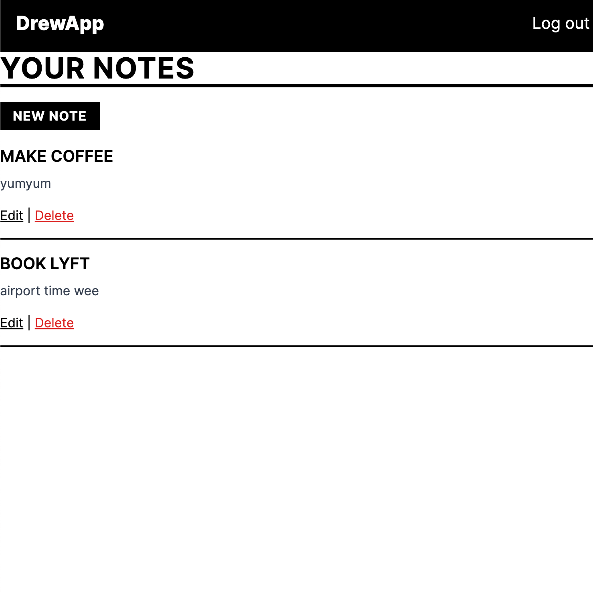

# DrewApp

DrewApp is a simple note management app built with Ruby on Rails.



## Requirements

- Ruby 3.3.4
- Rails 7.x
- PostgreSQL

## Getting Started
   ```bash
   git clone https://github.com/adnjoo/drewapp
   bundle install
   rails db:setup
   bin/dev
   ```
